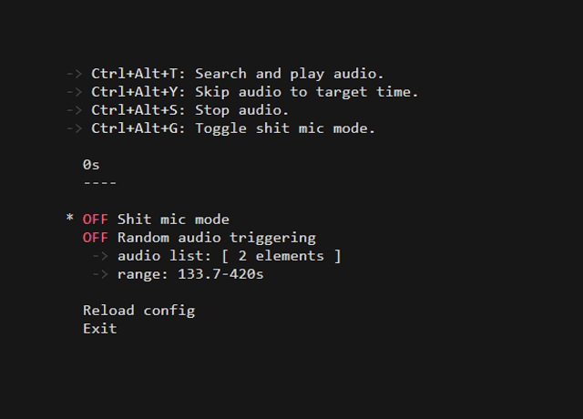

# keysounds


**keysounds** is a text user interface (TUI) app built in Rust that relays microphone input to a virtual audio output.
It allows mixing in audio files using global hotkeys and more.

## Features
- **Microphone forwarding** - Forwards microphone input to virtual output.
- **Audio playback using global hotkeys** - Play audio with keybinds:
  - `Ctrl+Alt+T` - Play audio
  - `Ctrl+Alt+Y` - Skip current audio to a predefined position (set in config)
  - `Ctrl+Alt+S` - Stop playing current audio
- **Shit mic mode** - Turns your microphone to a one inside a running microwave<sup title="this is a joke btw">[_[citation needed](https://en.wikipedia.org/wiki/Joke)_]</sup> by pressing `Ctrl+Alt+G`.
- **Random audio triggering** - Can be enabled to play a random audio from a configurable list every X to Y seconds.

_Hotkeys are not yet configurable._

## Installation
Get a prebuilt for your system (Windows only for now) executable on the [Releases](https://github.com/nieboczek/keysounds/releases) tab or compile it yourself by following the steps below.

1. Install Rust and Cargo if not already installed: [https://rust-lang.org/tools/install](https://www.rust-lang.org/tools/install)
2. Clone this repository:
   ```sh
   git clone https://github.com/nieboczek/keysounds.git
   cd keysounds
   ```
3. Build and run:
   ```sh
   cargo run --release
   ```

**Make sure to configure the Virtual Output Device after running keysounds once**

## Configuration
keysounds uses a TOML config file that will be automatically generated next to the executable after the first run. Here are the configuration options:
```toml
# Your microphone device name
input_device = "Microphone (2- Shure MV7)"
# Your virtual output device name
# (Cable for Windows/Mac: https://vb-audio.com/Cable)
output_device = "CABLE Input (VB-Audio Virtual Cable)"
# Random Audio Triggering time range in seconds
# (currently 133.7s to 420s between audios)
rat_range = [133.7, 420]
# List of audios that can be selected by Random Audio Triggering
rat_audio_list = ["METAL PIPE", "Moyai 🗿"]

# An audio object
[[audios]]
name = "Dream Speedrun Music" # Unique identifier used in audio search
path = "D:/music/dream_speedrun.mp3" # Path to the audio file
skip_to = 114.2 # (Optional; Default = 0) Position in seconds to skip to
volume = 0.9 # (Optional; Default = 1) Audio volume (1.0 = 100%)

[[audios]]
name = "Moyai 🗿"
path = "D:/sfx_ogg/moyai.ogg"

[[audios]]
name = "METAL PIPE"
path = "D:/sfx/metal_pipe.mp3"
volume = 0.69
```

## Contributing
Contributions are welcome!  
Feel free to:
- Open issues for bugs or feature suggestions.
- Submit PRs for fixes or new features.
- Discuss ideas in the issues tab.

## License
This project is licensed under the [GPL v3.0 License](https://github.com/nieboczek/keysounds/blob/master/LICENSE).
